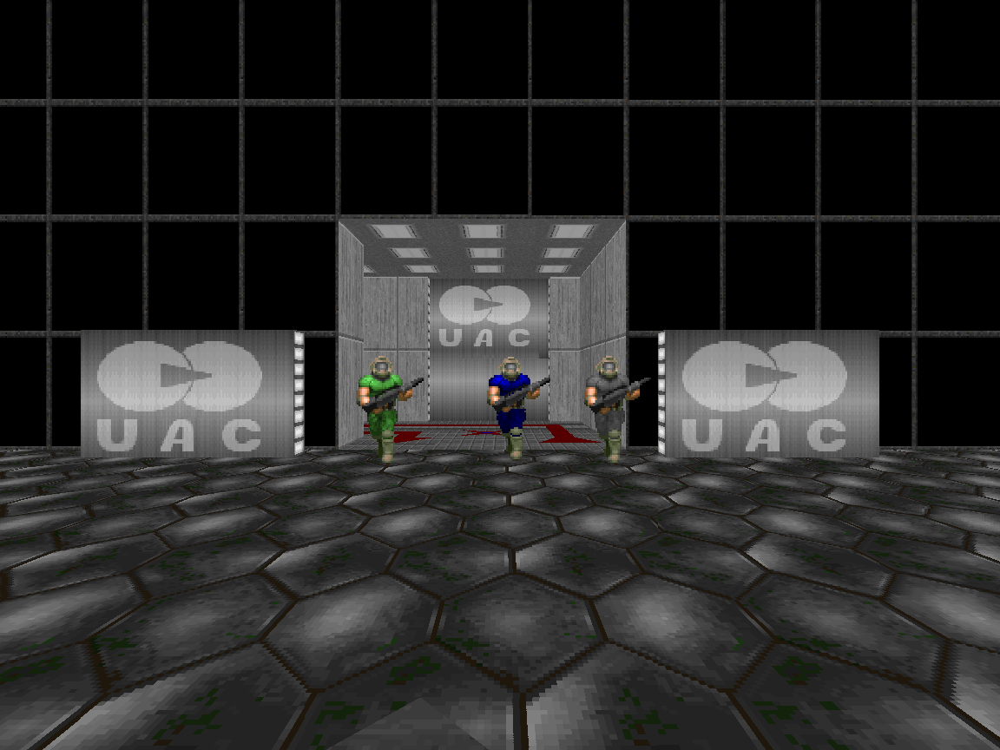
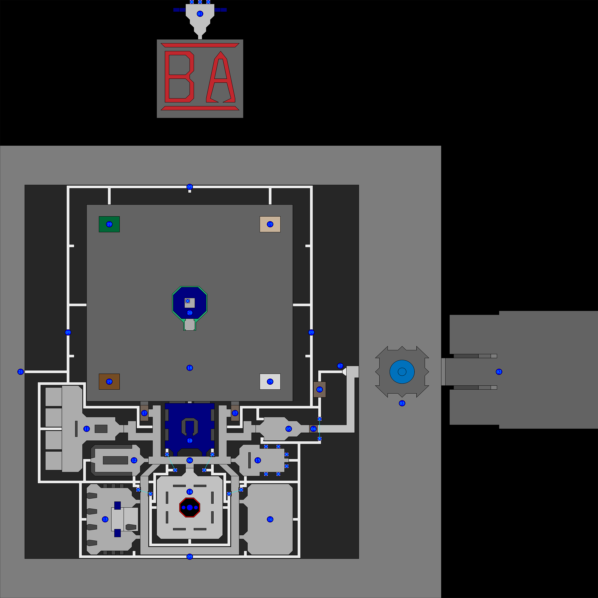

# 🏛️ Battle Arena – A Doom Co-op Sandbox

Battle Arena is a single-level modification for **Doom (TNT: Evilution)** designed as a long-form co-op playground.  
Defend a UAC research facility, explore its rooms and maintenance shafts, survive demon outbreaks, and role-play Marines, workers, or SWAT teams during escalating containment failures.

This repository contains:

- The official **BA.WAD** release  
- A fully responsive **GitHub Pages website**  
- Screenshots, map diagrams, and the original user guide  

🌐 **Live Site:** https://crankyhippo.github.io/doom-battle-arena/  
📦 **Download BA.WAD:** [`assets/files/BA.wad`](assets/files/BA.wad)

---

## 📸 Screenshots

More screenshots available on the site.

---

## 🎮 How to Play

**Requirements:**

- Base game: *Final Doom – TNT: Evilution* (`TNT.WAD`)
- PWAD: `BA.WAD`
- Recommended source port: **Doom Legacy**
- Recommended multiplayer lobby: **Doom Connector**

**Typical Setup (Co-op):**

- Game Mode: Cooperative  
- Skill: Nightmare (for intended chaos)  
- Friendly Fire: Enabled  
- Additional File: `BA.WAD`  

Full gameplay and role-play structure are described on the website.

---

## 🗺️ Level Map

The facility is a loop of corridors, rooms, bunkers, and a large central Arena.  
A detailed map image with numbered areas is included in:

🛠️ For Developers

This project intentionally uses:

Plain HTML + CSS for long-term maintainability

No build dependencies

Relative asset paths to work smoothly on GitHub Pages

Contributions and improvements are welcome.

👥 Credits

Battle Arena designed by Worldwide Cake:

Alex “Anelf3” Gumpel – Lead Designer

Bryan “CrankyHippo” Burnett – VP of Conceptual Design

Derek “Gorden” Bowker – VP of Scientific Endeavors

George “Niatona” Pryor – VP of Foreign Affairs

Website built and maintained by Bryan Burnett.

⚠️ Legal

Doom, Final Doom, TNT: Evilution, and related assets and trademarks are property of id Software / Bethesda.
This project is a community modification and is not affiliated with id Software.

Only BA.WAD, screenshots, the website, and accompanying documentation are licensed under this repository’s open-source license.

